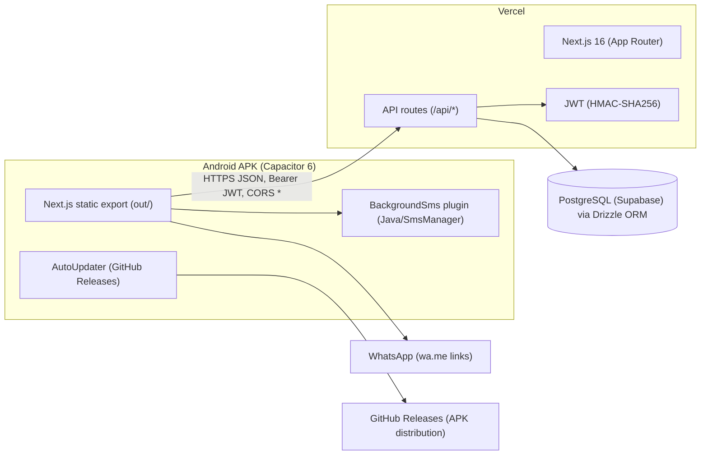

# ARCHITECTURE.md — System Design

## 1. High-Level Architecture

**Pattern: Hybrid monolith + static mobile client.** WHY: one Next.js codebase serves both web and APK; the server stays a simple monolith (no microservices overhead for a single-shop app).

## 2. Frontend Architecture

- App Router, single protected shell: `src/app/page.tsx` (4 tabs).
- Tabs are **state-based, not route-based**: `home | khata | reports | settings`. All tab panels stay mounted, toggled with `display:none`.
- All internal navigation uses `router.replace()` (no history stack in WebView).
- Components:
  - `QuickEntry` — entry form + dashboard + recent list + SMS trigger.
  - `KhataBook` — customer list + search + add/edit/delete customer; hosts `CustomerDetail`.
  - `CustomerDetail` — summary, transactions/payments/bills tabs, WhatsApp actions, payment modal, delete modal.
  - `Reports` — charts (recharts).
  - `Settings` — rates, shop info, backup export, update check.
  - `Header` (online/offline badge), `BottomNav`, `PullToRefresh`, `AutoUpdater`, `BillsList`, `AddCustomer`, `SyncProvider`.
- State: React `useState` + `AuthContext`. Server data via `src/lib/api.ts`. Offline cache + pending queue via `src/lib/offline-db.ts`.

## 3. Backend Architecture

Layers per route: `route.ts` → `getUserIdFromRequest()` → Drizzle query → `ok()`/`err()` JSON.

- No service/repository split (WHY: CRUD is thin; extra layers add files without value at this scale).
- Auth helper: `src/lib/auth.ts` (sign/verify HMAC-SHA256 JWT, no expiry).
- CORS helper: `src/lib/cors.ts` (`*` origin, standard methods/headers).
- Config: `src/lib/config.ts` (`API_BASE = https://chakki-mitra.vercel.app`).

## 4. Data Flow

1. User saves entry → `POST /api/transactions` (Bearer JWT).
2. Server inserts row, returns it.
3. Client updates local state, recalculates summary locally (no refetch).
4. If native: fetch `/api/customers/detail?id=`, build professional SMS, call `BackgroundSms.sendSms`.
5. Java plugin cleans number, checks `SEND_SMS`, sends via `SmsManager`.
6. Offline: writes queued in `localStorage` (`cm_pending_ops`); GETs served from cache (`cm_cache_*`, 5-min TTL); `useSyncPending` replays queue when online.

## 5. Third-Party Integrations

| Integration | How |
|---|---|
| Google OAuth | Login redirect → callback → JWT issuance |
| SMS | Custom Capacitor plugin → Android `SmsManager` (device SIM) |
| WhatsApp | `wa.me/91<phone>?text=` links, no API |
| GitHub Releases | APK distribution + in-app update check |

## 6. Caching Strategy

- Client: `localStorage` GET cache (5-min TTL) + full settings fallback.
- No Redis/CDN custom config; Vercel edge caching is default.

## 7. Scalability Plan

Now: single Vercel deployment + managed Postgres handles hundreds of shops (each shop's data is `userId`-scoped). Later: add JWT expiry + refresh, paginate `/api/transactions` (currently `LIMIT 100`), index `customerId`/`userId` columns.

## 8. Security Layers

- Per-route `getUserIdFromRequest()`; every query scoped by `userId`.
- `careful`: CORS is `*` (required for `capacitor://` origin).
- Passwords: `password` column exists; current flows are email-link/Google/guest + JWT.
- Secrets: `JWT_SECRET` env on Vercel; Android keystore in GitHub Secrets.
- No rate limiting yet — [TBD].
