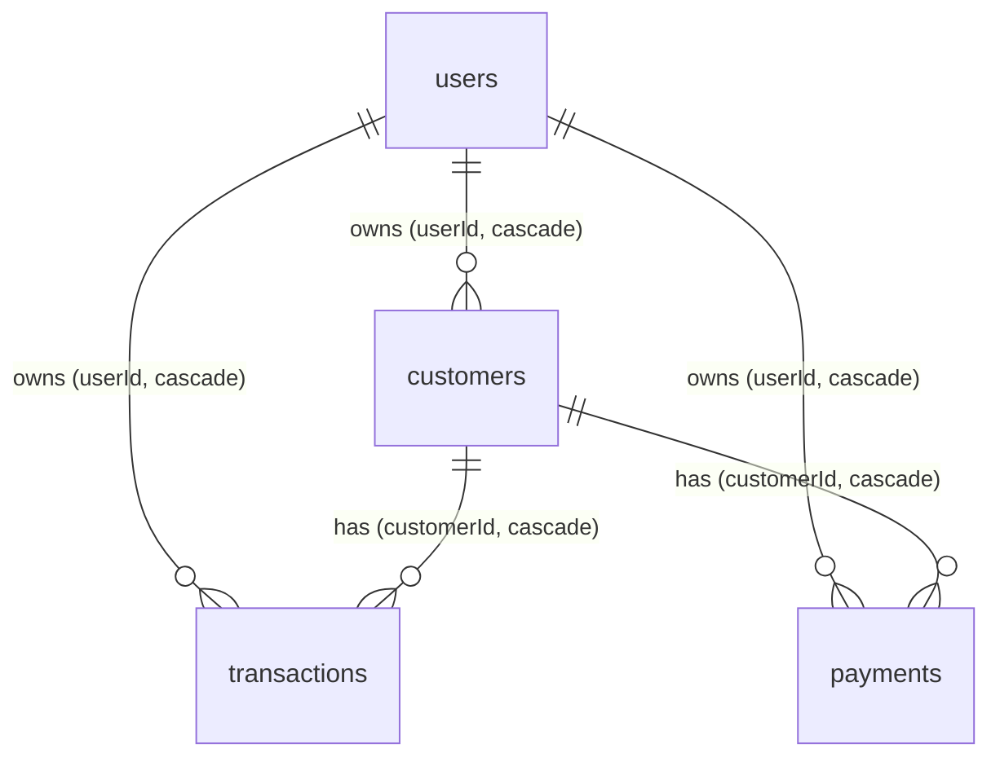

# DATABASE_SCHEMA.md — Database Design

DB: PostgreSQL. ORM: Drizzle (`src/db/schema.ts`, `src/db/index.ts`). Migrations: `drizzle-kit push --force` (`npm run db:push`).

## ER Diagram

## Tables

### users

| Column | Type | Constraints |
|---|---|---|
| id | serial | PK |
| google_id | varchar(200) | UNIQUE |
| email | varchar(300) | NOT NULL |
| name | varchar(200) | nullable |
| phone | varchar(20) | nullable |
| shop_name | varchar(200) | nullable |
| shop_phone | varchar(20) | nullable |
| atta_rate | numeric | nullable |
| dalia_rate | numeric | nullable |
| password | varchar(255) | nullable |
| is_registered | boolean | DEFAULT false |
| created_at | timestamp | DEFAULT now() |

### customers

| Column | Type | Constraints |
|---|---|---|
| id | serial | PK |
| user_id | integer | NOT NULL, FK → users.id ON DELETE CASCADE |
| name | varchar(200) | NOT NULL |
| phone | varchar(20) | NOT NULL |
| address | text | DEFAULT '' |
| created_at | timestamp | DEFAULT now() |

### transactions

| Column | Type | Constraints |
|---|---|---|
| id | serial | PK |
| user_id | integer | NOT NULL, FK → users.id ON DELETE CASCADE |
| customer_id | integer | NOT NULL, FK → customers.id ON DELETE CASCADE |
| product_type | enum `product_type` | NOT NULL (`atta`, `dalia`) |
| weight | numeric | NOT NULL |
| rate | numeric | NOT NULL |
| amount | numeric | NOT NULL |
| payment_mode | enum `payment_mode` | NOT NULL (`cash`, `credit`) |
| notes | text | DEFAULT '' |
| created_at | timestamp | DEFAULT now() |

### payments

| Column | Type | Constraints |
|---|---|---|
| id | serial | PK |
| user_id | integer | NOT NULL, FK → users.id ON DELETE CASCADE |
| customer_id | integer | NOT NULL, FK → customers.id ON DELETE CASCADE |
| amount | numeric | NOT NULL |
| type | enum `payment_type` | NOT NULL (`advance`, `dues_payment`, `partial_payment`) |
| description | text | DEFAULT '' |
| created_at | timestamp | DEFAULT now() |

### test_table (legacy, unused)

| Column | Type |
|---|---|
| id | serial PK |
| name | varchar(255) |
| created_at | timestamp DEFAULT now() |

Recommendation: drop `test_table` in a future migration.

## Derived fields (computed in code, not stored)

- `totalBilled` = SUM(transactions.amount WHERE payment_mode='credit')
- `totalJama` = SUM(payments WHERE type IN ('dues_payment','partial_payment'))
- `pendingDues` = MAX(0, totalBilled − totalJama)
- `effectiveAdvance` = advance + overpayment credit

## Indexes

Current schema relies on PK/FK indexes only. Recommended later: composite index on `(user_id, customer_id)` for `transactions` and `payments` (ledger queries are always scoped this way).

## Migration Strategy

`drizzle-kit push --force` directly to Supabase. WHY: single-developer velocity over migration-file ceremony. Risk accepted: destructive pushes possible — take a backup before schema edits.

## Delete Policy

Hard delete with `ON DELETE CASCADE` everywhere (customer delete wipes their ledger). No soft delete. Retention: indefinite — [TBD if auto-archive needed].
