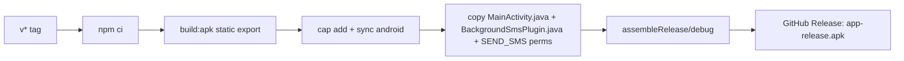

# DEPLOYMENT.md — Deploy Guide

## 1. Environments

- Production only: Vercel (web+API) + GitHub Releases (APK). No staging.

## 2. Web (Vercel)

Push to `main` → Vercel runs `npm run build` (`db:push` + `next build`). Env vars (`DATABASE_URL`, `JWT_SECRET`) set in Vercel dashboard.

## 3. APK (GitHub Actions)

Trigger: push tag `v*` (e.g. `v1.0.24`).

Key steps in `build-android.yml`: SDK 35 patch, `SEND_SMS`/`READ_SMS` + install/storage permissions, static `MainActivity.java` copy (with `registerPlugin`), signing from `ANDROID_KEYSTORE_*` secrets, `versionCode` from date, release upload `fail_on_unmatched_files: false`.

## 4. Domain & SSL

`chakki-mitra.vercel.app` (Vercel-managed SSL). Custom domain — [TBD].

## 5. Rollback

- Web: redeploy previous Vercel deployment.
- APK: previous GitHub Release asset; `AutoUpdater` only upgrades, never downgrades — user must manually install older APK.

## 6. Monitoring / Backup

- No Sentry/uptime checks — [TBD].
- Backup: Settings → export JSON (manual). DB backups via Supabase defaults.
