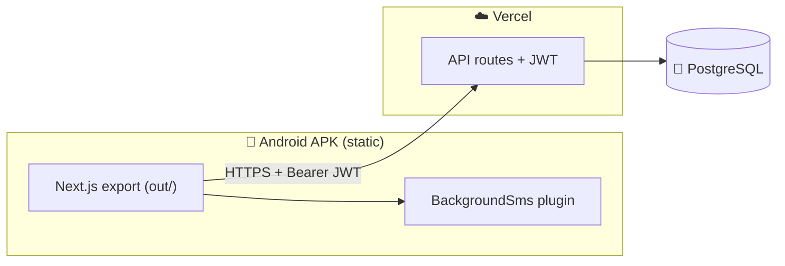

<div align="center">


[](https://nextjs.org/)
[](https://capacitorjs.com/)
[](https://supabase.com/)
[](https://orm.drizzle.team/)
[](https://github.com/aman2006855/chakki-mitra/releases)
[](https://tailwindcss.com/)


**`कॉपी` नहीं — `कॉपी` खत्म। एक एंट्री, एक SMS, जीरो भूल। ✨**

[🌐 Live App](https://chakki-mitra.vercel.app) • [📦 Latest APK](https://github.com/aman2006855/chakki-mitra/releases) • [📚 Docs](#-documentation-map) • [🚀 Deploy](#-deployment)

</div>

---

## ✨ 𝒲𝒽𝓎 𝒞𝒽𝒶𝓀𝓀𝒾 𝑀𝒾𝓉𝓇𝒶?

> 🏪 *"Ramesh ne 15kg atta piswaya tha... ya 20kg? Paise diye the kya?"*
>
> **Ye confusion ab hamesha ke liye khatm.** 📒➡️📱

<div align="center">

| 😩 **Pehle (Kaagaz)** | 🤩 **Ab (Chakki Mitra)** |
|:---|:---|
| Bahi kho jaati thi | ☁️ Cloud me safe, kabhi nahi khoyega |
| Udhaar yaad nahi rehta | ⏳ Har customer ka bakaya ek tap par |
| Customer ko yaad dilana awkward | 📲 Auto SMS receipt + WhatsApp reminder |
| Light/internet gaya = kaam band | 📴 Offline-first — bina net ke bhi full app |

</div>

---

## 🎯 ˗ˏˋ ★ ˎˊ˗ Features ˗ˏˋ ★ ˎˊ˗

<details open>
<summary><b>⚡ Quick Entry — 10 second me billing</b></summary>

- 🌾 Atta / Dalia toggle with shop rates
- 🔍 Customer search (naam ya phone se)
- ⚖️ Weight → auto amount calculation
- 💵 Cash / Udhaar mode
- 🛡️ Double-tap guard — 1 tap = 1 entry, duplicate impossible

</details>

<details open>
<summary><b>📒 KhataBook — poora hisaab, ek jagah</b></summary>

- 👥 Dues-wise sorted customer list
- 📊 Per-customer summary: billed • jama • advance • bakaya
- 🗑️ Entry delete with warning confirmation
- 💰 Payment modal (advance / dues / partial)
- ⚡ Instant local updates — koi page reload nahi!

</details>

<details open>
<summary><b>📲 Auto SMS — customer khush, dukandaar khush</b></summary>

```
🌾 श्री श्याम आटा चक्की
👤 ramesh kumar
━━━━━━━━━━━━━━
🛒 आज की पिसाई:
📝 आटा 15kg × ₹5 = ₹75 (उधारी)
━━━━━━━━━━━━━━
🌾 आटा: 30kg = ₹150
🥣 दलिया: 20kg = ₹120
💰 कुल बिल: ₹270 | ⏳ बकाया: ₹270
🙏 धन्यवाद!
```

- 🇮🇳 Hindi Unicode support (67-char smart split)
- 📴 Custom native plugin — server ka 1₹ bhi kharch nahi, SIM se seedha SMS!

</details>

<details>
<summary><b>💬 WhatsApp Magic + 📊 Reports + ⚙️ aur bhi...</b></summary>

- 💬 Itemized bill + dues reminder, seedha WhatsApp par
- 📊 Sales charts (recharts) — aaj ki kamai, nagad vs udhaar
- 📴 **Offline-first**: bina internet full app, wapas aate hi auto-sync 🔄
- 🔄 In-app auto-updater via GitHub Releases
- 👆 Pull-to-refresh, back-button handling, zoom-lock — pure native feel

</details>

---

## 🛠️ 𝒯𝑒𝒸𝒽 𝒮𝓉𝒶𝒸𝓀

<div align="center">

| Layer | Tech |
|:---|:---|
| 🎨 Frontend | Next.js `16.2.6` • React `19` • Tailwind `4.1` • lucide-react • recharts |
| 📱 Mobile | Capacitor `6.2.0` (`@capacitor/app@6.0.3`, `@capacitor/browser@6.0.6`) |
| 🔧 Backend | Next.js API routes • Drizzle ORM `0.45.2` • `pg` • Custom HMAC JWT |
| 🗄️ Database | PostgreSQL (Supabase) |
| ☁️ Hosting | Vercel (web + API) • GitHub Releases (APK) |
| 🔌 Native | Custom `BackgroundSms` plugin (Java + `SmsManager`) |

</div>

---

## 🏗️ 𝒜𝓇𝒸𝒽𝒾𝓉𝑒𝒸𝓉𝓊𝓇𝑒



> 💡 **Ek codebase, do duniya** — wahi Next.js code web par bhi, APK me bhi. APK me sirf frontend bundle hota hai, API Vercel se aati hai.

---

## 🚀 𝒬𝓊𝒾𝒸𝓀 𝒮𝓉𝒶𝓇𝓉

```bash
# 1️⃣ Clone karo
git clone https://github.com/aman2006855/chakki-mitra.git
cd chakki-mitra

# 2️⃣ Dependencies
npm install

# 3️⃣ Environment
cp .env.example .env   # DATABASE_URL + JWT_SECRET bhardo

# 4️⃣ Database push + dev server
npm run db:push
npm run dev   # → http://localhost:3000 🎉
```

| Command | Kaam |
|:---|:---|
| `npm run dev` | 💻 Local dev server |
| `npm run build` | 🏗️ DB push + production build (Vercel) |
| `npm run build:apk` | 📦 Static export for APK |
| `npm run lint` / `typecheck` | 🧹 Lint + type check |
| `npm run db:push` / `db:studio` | 🗄️ Schema push / visual DB studio |

---

## 📦 𝒜𝒫𝒦 𝐵𝓊𝒾𝓁𝒹

Push a tag → GitHub Actions signed APK banake Release me daal deta hai:

```bash
git tag v1.0.25 && git push origin v1.0.25
# → .github/workflows/build-android.yml
# → app-release.apk + app-debug.apk 🎉
```

---

## 📚 𝒟𝑜𝒸𝓊𝓂𝑒𝓃𝓉𝒶𝓉𝒾𝑜𝓃 𝑀𝒶𝓅

> 🤖 AI agents: har nayi chat me `PROJECT_CONTEXT.md` + `CODING_STANDARDS.md` pehle padho!

| 📄 File | 📝 Kya hai |
|:---|:---|
| `PROJECT_CONTEXT.md` | 🧠 Master brain file — single source of truth |
| `ARCHITECTURE.md` | 🏗️ System design + data flow |
| `TECH_STACK.md` | ⚙️ Versions + WHY |
| `DATABASE_SCHEMA.md` | 🗄️ Tables + ER diagram |
| `API_SPEC.md` | 🔌 Endpoints + auth |
| `FILE_STRUCTURE.md` | 📂 Folder map |
| `USER_FLOWS.md` | 🚶 User journeys |
| `UI_UX_GUIDELINES.md` | 🎨 Design system |
| `AUTH_FLOW.md` | 🔐 JWT + OAuth |
| `STATE_MANAGEMENT.md` | 🔄 State + offline |
| `CODING_STANDARDS.md` | 📏 Code rules |
| `ENVIRONMENT_SETUP.md` | 💻 Dev setup |
| `DEPLOYMENT.md` | 🚀 Vercel + APK |
| `FEATURE_BREAKDOWN.md` | 📦 Features + priority |
| `TESTING_STRATEGY.md` | 🧪 Testing plan |
| `ERROR_HANDLING.md` | ⚠️ Error patterns |
| `CHANGELOG.md` | 📝 Change log |

---

## 🤝 𝒞𝑜𝓃𝓉𝓇𝒾𝒷𝓊𝓉𝒾𝓃𝑔

1. 🍴 Fork karo → 🌿 branch banao → ✍️ change karo → 📩 PR kholo
2. Conventional commits: `feat:` `fix:` `docs:` `chore:`
3. PR se pehle: `npm run lint` + `npm run typecheck` ✅

---

<div align="center">


**🌾 `चक्की मित्र` — har pisai ka hisaab, har grahak ka vishwaas 💛**

⭐ Star karna mat bhoolna! • 🐛 Issue? [Yahan batao](https://github.com/aman2006855/chakki-mitra/issues)

</div>
